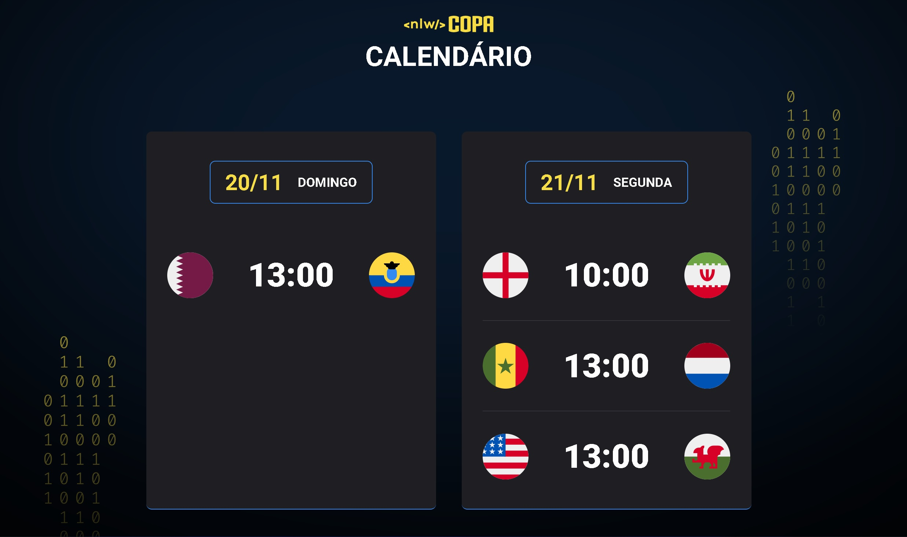

<h1 align="center"> Projeto NLW #10 - Copa do Mundo: Explorer </h1>

Projeto criado via evento da Rocketseat

  

Projeto de criação de uma página com o calendário de jogos da copa do mundo com visibilidade via web e mobile baseado na largura da página.

[:link: Acesse aqui a página](https://mateussilva93.github.io/03.NLW10_Copa_Explorer/)

## :wrench: Tecnologia

- HTML
- CSS
- JavaScript
- Git e Github
